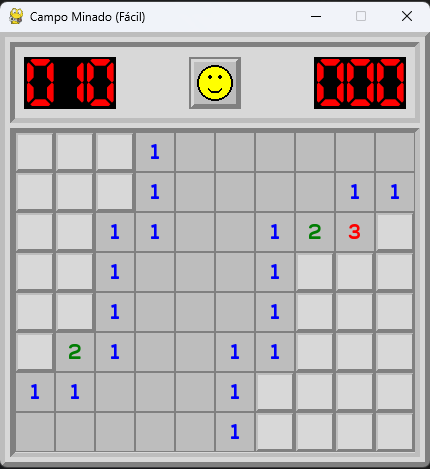
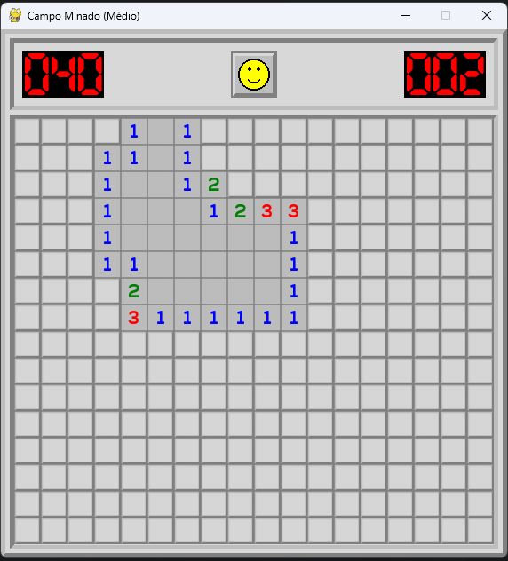
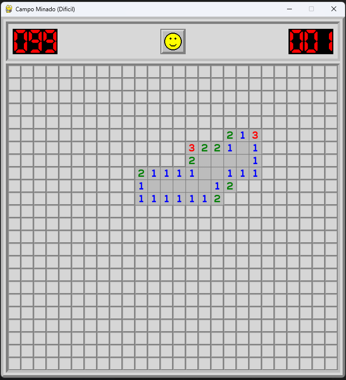

# Minesweeper

Recreation of the classic Windows XP Minesweeper in Pygame-CE

    <strong style="font-size: 18px;">Win with style</strong>
     
    
     
    

    <strong style="font-size: 18px;">Go out with a bang!</strong>
     
    
     
    

## Controls

* **Left Click:** Reveal tile
* **Right Click:** Place/remove flag
* **Emoji Click:** Reset game or change difficulty
* **`R` Key:** Reset board

## Game Modes

    <strong style="font-size: 18px;">Easy - 10 Mines</strong>
     
    

    <strong style="font-size: 18px;">Medium - 40 Mines</strong>
     
    

    <strong style="font-size: 18px;">Hard - 99 Mines</strong>
     
    

## Contributors

